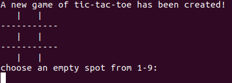

# Tic-Tac-Toe

## Description

A Tic-Tac-Toe game built with Ruby that you can play in your command line

## Installation

You must have ruby version 2.7.0 >=

## Usage

1. clone this repository to your local machine
2. cd into that directory then run the command

```
  ruby tictactoe.rb
```

## Preview



## Acknowledgment

[The Odin Project](https://www.theodinproject.com/)
